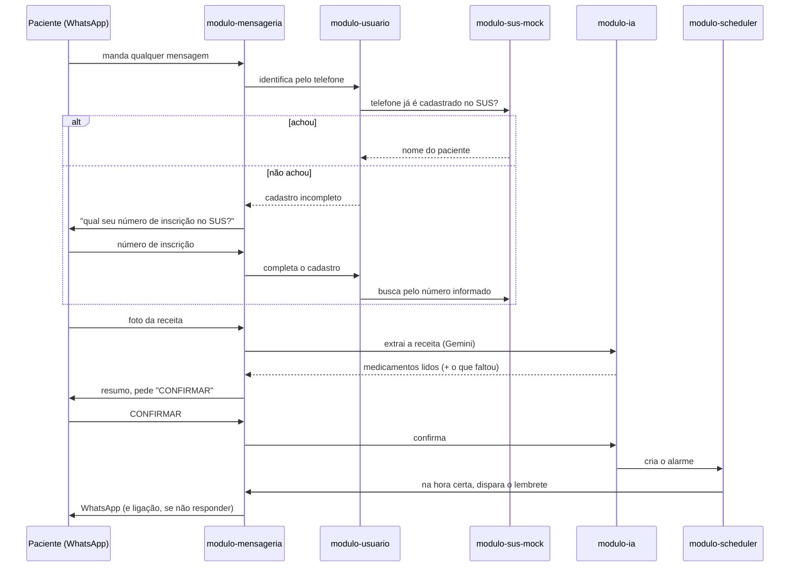

# DoseAlerta

Sistema de lembretes de medicação: o paciente manda a foto da receita no WhatsApp, a IA lê e monta os alarmes, e o DoseAlerta avisa por WhatsApp (e ligação, se preciso) até ele confirmar a dose.

## Como funciona



O SUS de verdade não existe aqui — `modulo-sus-mock` simula essa consulta (por telefone primeiro; se não achar, pede o número de inscrição e tenta de novo). É a única peça inventada; o resto (extração por IA, confirmação, alarme, adesão) é real.

## Variáveis de ambiente

Copie `.env.example` para `.env` e preencha os valores (o `.env` não é versionado).

- **Chaves JWT** (base64 DER): gere o par com `openssl genpkey -algorithm RSA -pkeyopt rsa_keygen_bits:2048 -out private.pem`. A chave privada (`JWT_PRIVATE_KEY`, PKCS#8) sai de `openssl pkcs8 -topk8 -nocrypt -in private.pem -outform DER | base64 -w0` e a pública (`JWT_PUBLIC_KEY`) de `openssl pkey -in private.pem -pubout -outform DER | base64 -w0`.
- **Twilio**: `TWILIO_WHATSAPP_NUMBER` é o número do Sandbox do WhatsApp (sem o prefixo `whatsapp:`) e `TWILIO_WEBHOOK_BASE_URL` é a URL pública (ex.: ngrok) do gateway, a mesma configurada em "WHEN A MESSAGE COMES IN" no Console da Twilio.
- **Escalonamento**: `SCHEDULER_ESCALONAMENTO_INTERVALO_ENTRE_ETAPAS_MS` (padrão 900000, 15 min) é a espera entre lembrete, reforço e ligação, e `SCHEDULER_ESCALONAMENTO_INTERVALO_MS` (padrão 60000) é a frequência com que o scheduler procura alarmes a escalar. Para testar a ligação sem esperar, use por exemplo 20000 e 10000 no `.env`.
- **IA**: `IA_MOCK_DE_EMERGENCIA_HABILITADO=true` devolve dados fixos quando o Gemini falha; deixe `false` fora de demonstrações.

## Módulos

Gradle multi-módulo, um Spring Boot por módulo. Convenção de pacotes em todos: `core` (domínio, casos de uso, portas) e `infra` (Spring, adapters, banco).

| Módulo | Porta | O que faz |
|---|---|---|
| `api-gateway` | 8080 | Porta de entrada: JWT, rate limit, roteia pro módulo certo |
| `modulo-usuario` | 8081 | Cadastro, login, identificação do paciente pelo telefone |
| `modulo-sus-mock` | 8087 | Simula a consulta ao SUS (telefone ou número de inscrição → nome) |
| `modulo-ia` | 8082 | Lê a foto da receita com o Gemini, guarda a receita, confirma |
| `modulo-scheduler` | 8083 | Decide quando cada etapa do alarme dispara |
| `modulo-notificacao` | 8084 | Decide o canal de cada etapa (WhatsApp ou ligação) |
| `modulo-mensageria` | 8085 | Fala com a Twilio: manda/recebe WhatsApp, faz ligação |
| `modulo-relatorio-adesao` | 8086 | Taxa de adesão por paciente/medicamento |

## Rodando localmente

```bash
cp .env.example .env   # preenche chave JWT, Twilio, Gemini
docker-compose up -d   # Postgres (5433) e Jaeger (16686)
./gradlew build        # build + testes de todos os módulos
```

As variáveis do `.env` precisam estar exportadas no terminal onde os módulos rodam (`export $(cat .env | xargs)` ou o equivalente da sua IDE).

Pra rodar um módulo: `./gradlew :modulo-usuario:bootRun` (troque pelo nome do módulo). Pro fluxo ponta a ponta, sobe todos em terminais separados — ou usa a coleção do Postman (mais abaixo).

## API Gateway

Único ponto exposto pra fora. As demais portas (8081–8087) são só pra chamada módulo-a-módulo — nunca exponha elas na internet.

| Rota | Vai pra | Precisa de JWT? |
|---|---|---|
| `POST /pacientes`, `POST /auth/login` | `modulo-usuario` | não |
| `/receitas/**` | `modulo-ia` | sim |
| `GET /alarmes/{id}` | `modulo-scheduler` | sim |
| `GET /pacientes/{id}/adesao` | `modulo-relatorio-adesao` | sim |
| `POST /webhooks/twilio/**` | `modulo-mensageria` | não — a Twilio não manda JWT, quem valida é a assinatura (`X-Twilio-Signature`) |

O resto (criar alarme, notificações, `/pacientes/identificar`, `/interacoes`...) não existe no gateway: são chamadas internas, módulo-a-módulo. Isso é o que deixa seguro expor o gateway na internet (via ngrok) pros webhooks da Twilio chegarem — só o que está na tabela acima passa sem token.

## Twilio (WhatsApp e ligação)

Pra testar de verdade no celular, o caminho mais rápido é o **Sandbox do WhatsApp** (não precisa de aprovação da Meta, funciona na hora):

1. No Twilio Console, vá em **Messaging > Try it out > Send a WhatsApp message**. Ele mostra o número do sandbox (`+14155238886`) e um código, tipo `join palavra-aleatoria`.
2. Do seu celular, mande esse `join <código>` pra esse número no WhatsApp. Sem isso a Twilio não entrega nada pra você (erro 572002).
3. Preencha no `.env`: `TWILIO_ACCOUNT_SID`, `TWILIO_AUTH_TOKEN`, `TWILIO_WHATSAPP_NUMBER=+14155238886`.
4. Exponha o `api-gateway` (nunca o `modulo-mensageria` direto):
   ```bash
   ngrok http 8080
   ```
   Cola a URL gerada em `TWILIO_WEBHOOK_BASE_URL` no `.env` e reinicia o `modulo-mensageria` (é ele quem confere a assinatura contra essa URL).
5. Volta no Console, na configuração do Sandbox, e cola em **"WHEN A MESSAGE COMES IN"**: `{TWILIO_WEBHOOK_BASE_URL}/webhooks/twilio/mensagens`.
6. Manda uma mensagem qualquer pro número do sandbox. Se o telefone não estiver em `modulo-sus-mock`, ele vai te pedir o número de inscrição — usa `700000000000001` ou `700000000000002` (os dois fixos no mock). Depois manda a foto de uma receita de verdade.

**Ligação** é diferente: o número do sandbox de WhatsApp não liga. Precisa de um número Twilio próprio com voz (`Phone Numbers > Buy a number`; conta trial ganha um de graça) em `TWILIO_VOICE_NUMBER`, e o seu celular verificado em **Verified Caller IDs** pra poder receber.

## IA (modulo-ia)

Usa o Gemini (`generateContent`, saída estruturada). Chave em `GEMINI_API_KEY` (https://aistudio.google.com/apikey).

```yaml
ia:
  modelos: gemini-3.5-flash-lite,gemini-3.8-flash,gemini-flash-latest  # tenta nesta ordem
  mock-de-emergencia-habilitado: false  # ver "IA fora do ar" abaixo
```

- **Fallback entre modelos**: se um modelo devolver 503 (sobrecarregado) ou 429 (cota), tenta o próximo da lista antes de desistir.
- **Nada é inventado**: dose, frequência e duração que a receita não trouxer ficam `null` e entram em `camposPendentes` — o paciente informa na confirmação. Só imagem que não é receita formal (sem CRM/CRO do prescritor) é rejeitada.

### IA fora do ar

Duas saídas, pensadas pra não travar uma demonstração:

- **`POST /receitas/extrair-mock`**: mesmo contrato de `/receitas/extrair`, mas sempre devolve 2 medicamentos fixos, sem chamar o Gemini. Serve pra testar confirmação/alarme sem depender da IA — é o que a coleção `DoseAlerta.v2-mock.postman_collection.json` usa.
- **`ia.mock-de-emergencia-habilitado=true`** (ou `IA_MOCK_DE_EMERGENCIA_HABILITADO=true` no `.env`): se **até o fallback entre modelos falhar** no endpoint real, devolve os mesmos dados fixos em vez de quebrar a conversa no WhatsApp. Desligado por padrão — só liga sabendo que está mascarando uma falha real da IA (por exemplo, antes de gravar um vídeo de demonstração).

## Scheduler (modulo-scheduler)

`POST /alarmes` é idempotente por paciente + medicamento: se já existe um alarme `PENDENTE` do mesmo remédio, devolve 200 com o alarme existente em vez de duplicar (alarme novo: 201). Detalhes em `md/CONTRATOS_EVENTOS.md`.

## Relatório de adesão (modulo-relatorio-adesao)

Escuta as confirmações/não-confirmações do scheduler e responde em `GET /pacientes/{id}/adesao?inicio=&fim=` com `totalConfirmados`, `totalNaoConfirmados`, `totalLigacoesAtendidas` e `taxaConfirmacao` por medicamento.

## Observabilidade

- **Correlation-id**: todo request tem `X-Correlation-Id` (gerado se faltar), propagado nos logs e entre módulos.
- **Tracing**: OpenTelemetry → Jaeger (`http://localhost:16686`).
- **Métricas**: `/actuator/prometheus` em cada módulo (inclui `ia.extracao.latencia` e `alarme.desfecho`).
- **Logs**: JSON (Logstash), com correlation-id.

## Segurança

- JWT (RS256) emitido só pelo `modulo-usuario`; os demais módulos só validam.
- Rate limit no gateway (60 req/min por IP, em memória — não escala pra múltiplas réplicas).
- Segredos via variável de ambiente (`.env.example`), nunca hardcoded.
- Webhooks da Twilio validados por assinatura HMAC, não por JWT.

## Testes e cobertura

```bash
./gradlew test jacocoTestReport
```

Cobertura atual do projeto: **93% das linhas**. Mínimo exigido pelo build: 80% geral, 90% em `core.{domain,usecase,rules}` de cada módulo (`jacocoTestCoverageVerification`, roda junto do `build`).

## Postman

Duas coleções em `postman/`:

- **`DoseAlerta.postman_collection.json`**: a completa, usa o Gemini de verdade em *Extrair receita*.
- **`DoseAlerta.v2-mock.postman_collection.json`**: idêntica, mas *Extrair receita* chama `/receitas/extrair-mock` — use se o Gemini estiver fora do ar.

Ordem sugerida: **01 Usuário** (Cadastrar + Login preenchem `pacienteId`/`token`) → **02 IA** → **03 Scheduler** → **06 Relatório**. Rodar **06** sem passar pelo **03** antes cria o alarme automaticamente (mesmo assim, precisa de `telefoneTwilio` preenchido).

Pra rodar a coleção inteira: aponte o *Working directory* do Postman (Settings > General) pra pasta `postman/` — é de lá que *Extrair receita* lê `receita-exemplo.png`. Com Newman: `newman run postman/DoseAlerta.postman_collection.json --working-dir postman`.
